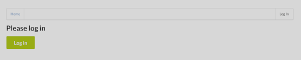
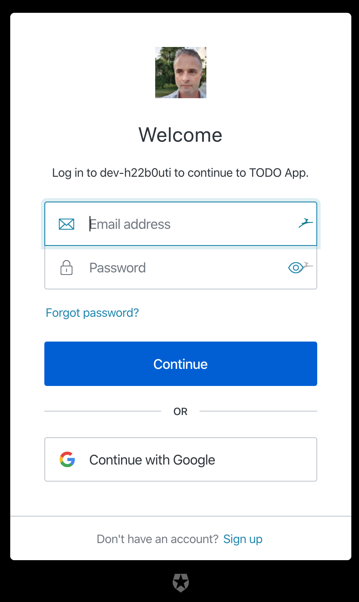
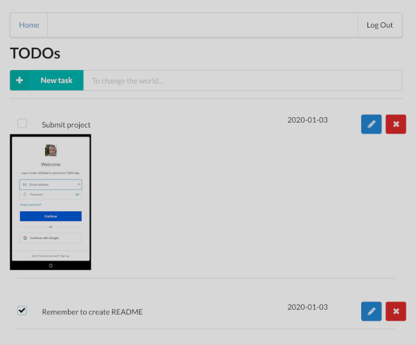

# ToDo App Serverless Project

This project demonstrates the setup of application components as 
a serverless application running on a Cloud Infrastructure

## Requirements
* Node 12
* serverless 1.60.4
* aws cli 1.16.257+


## Testing locally 
The client (React) application is pre-configured to connect to an AWS API Gateway (see src/config.ts)
that should be accessible if I haven't deleted or replaced the service 😄
```
cd client
npm install
npm start
```
The client should automatically start in your browser and load from http://localhost:3000


## Things I've learnt on this project
* Serverless framework
* Lambdas
* DynamoDB
* Presigned URLs for unconstrained uploads
* S3 Bucket storage
* IAM roles / permissions
* CloudWatch logging
* Optimisations
    * DynamoDB secondary indexes for performance
    * Individual packaging of lambdas to reduce footprint
    * Defining permissions per lambda for Principle of Least Privilege (see https://medium.com/@glicht/serverless-framework-defining-per-function-iam-roles-c678fa09f46d)


## Deploying your own Serverless App on AWS
This assumes that you already have an AWS Profile called *serverless* and are using *eu-west-2* region
(obviously you can substitute your own settings as required)
```sh
export NODE_OPTIONS=--max_old_space_size=4096

sls deploy -v --aws-profile serverless --aws-region eu-west-2
```
:warning: Note that NODE_OPTIONS is required for the _individually_ packaging option in *serverless.yml* to avoid Out Of Memory issues 


## Screenshots

### Before authorisation


### Auth0 asking user to authenticate


### Sample list of TODOs and an uploaded image

