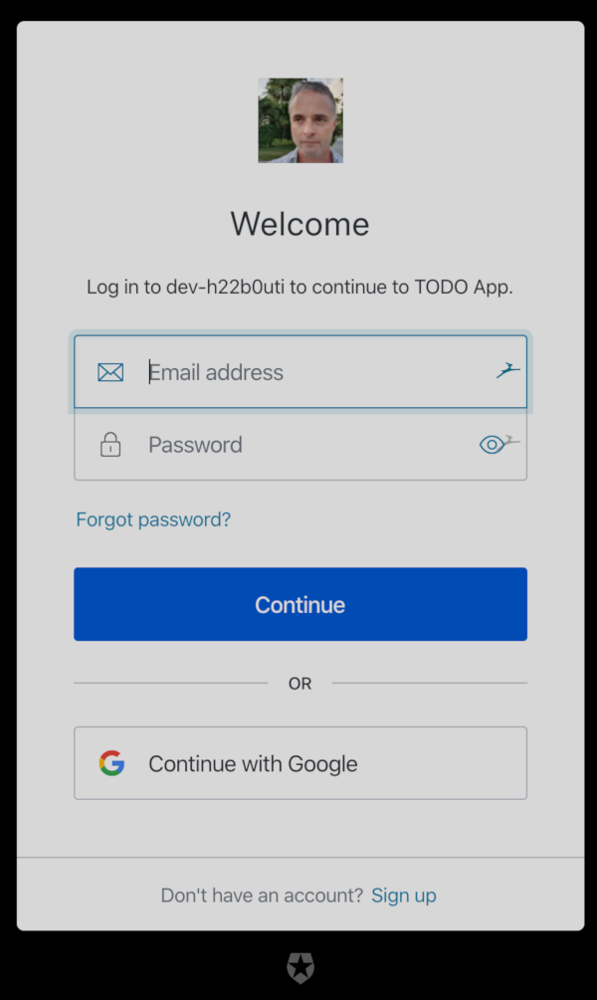

# ToDo App Serverless Project

This project demonstrates the setup of application components as 
a serverless application running on a Cloud Infrastructure

## Requirements
* Node 12
* serverless 1.60.4
* aws cli 1.16.257+


## Testing locally 
The client (React) application is pre-configured to connect to an AWS API Gateway (see src/config.ts)
that should be accessible if I haven't deleted or replaced the service 😄
```
cd client
npm install
npm start
```


## Deploying your own Serverless App on AWS
This assumes that you already have an AWS Profile called *serverless* and are using *eu-west-2* region
(obviously you can substitute your own settings as required)
```
sls deploy -v --aws-profile serverless --aws-region eu-west-2
```


## Screenshots




